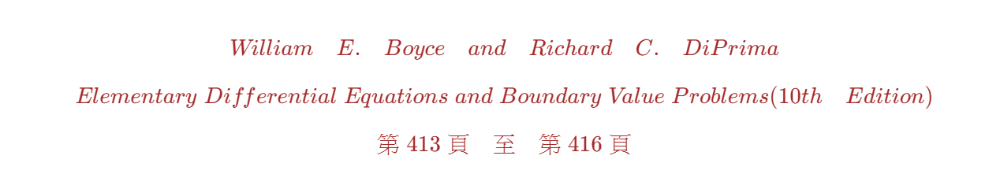
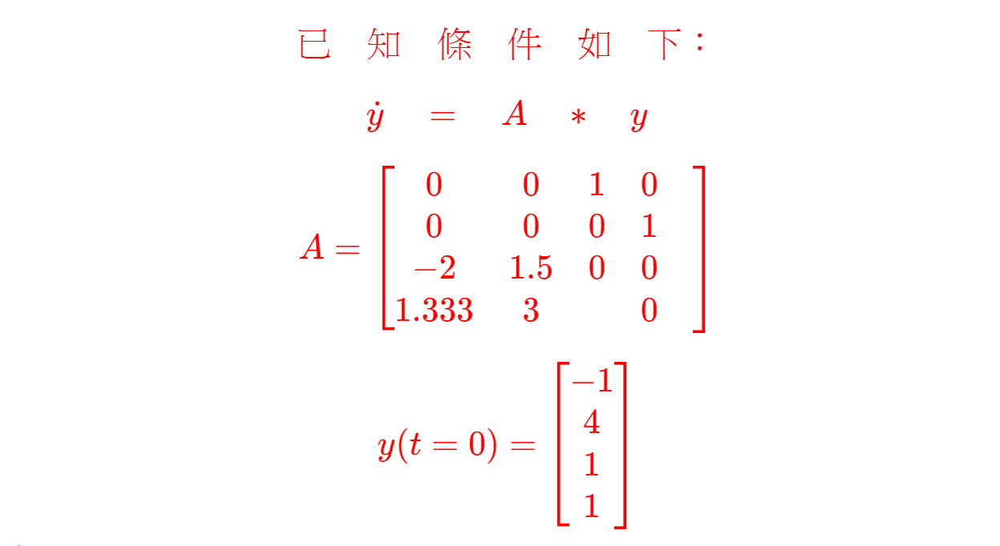
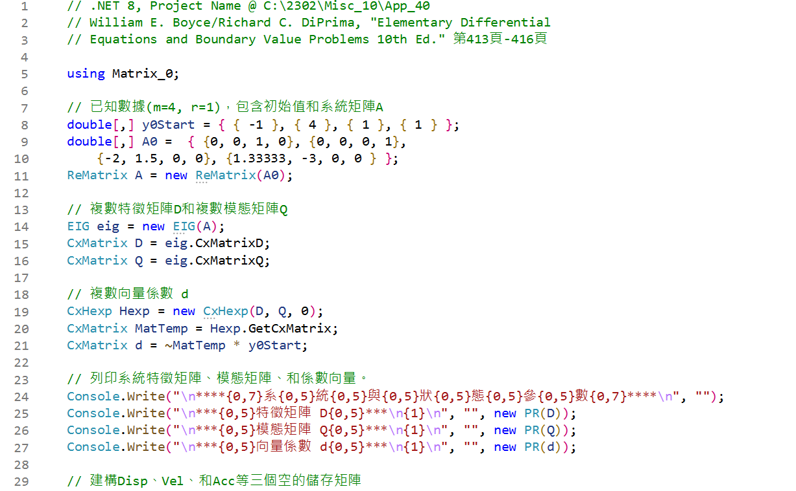
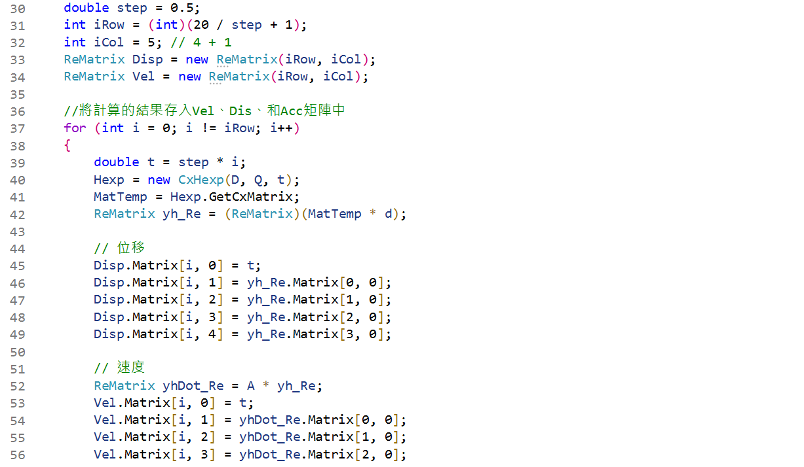
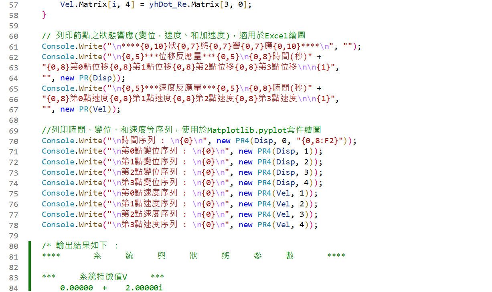
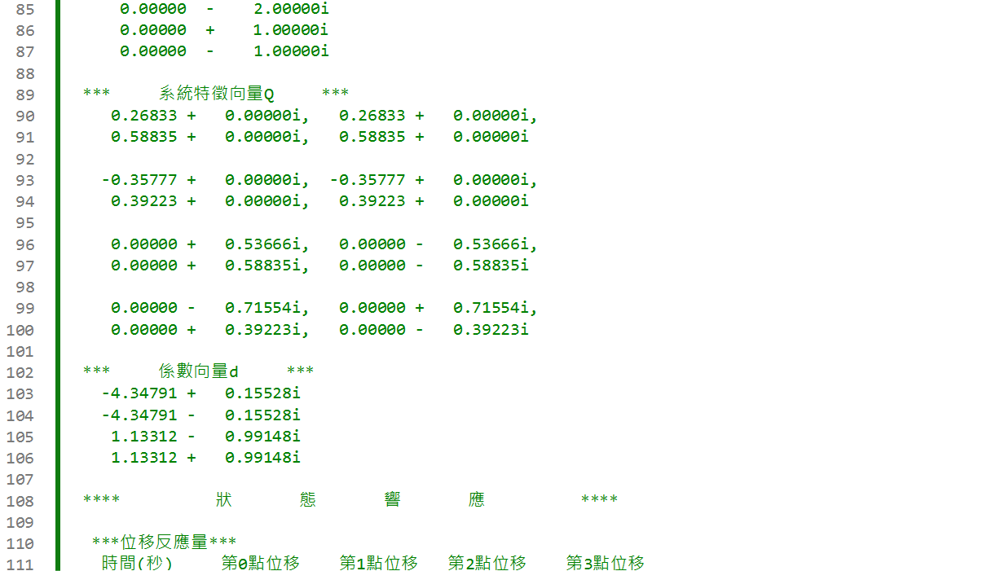

<!--    ConsoleApp40  README.md    --> 

 
<!--   
# 
# \[ {\color{Fuchsia}精\;銳\;矩\;陣\;計\;算\;求\;解\;器} \]  
## \[ {\color{Green} 【Sharp \; Matrix \; Solver \quad\; S\; M\; S】 } \] 
-->  

<!--  
##### \[{ \color{Brown} William \quad E. \quad Boyce \quad and \quad Richard \quad C. \quad DiPrima} \]
##### \[{ \color{Brown} Elementary \; Differential \; Equations \; and \; Boundary \; Value \; Problems (10th \quad Edition)   } \]  
##### \[{  \color{Brown} 第\;413\;頁\quad 至 \quad第\;416\;頁  }\]  
-->  

  
<!--      
### \[{  \color{Red} 已 \quad 知 \quad 條 \quad 件 \quad 如 \quad 下 ：   }\]
### \[{   \color{Red} \dot{y} \quad = \quad A \quad \ast \quad y     }\]  
###  \[{   \color{Red} A = \begin{bmatrix} 0 & 0 & 1 & 0 \quad \\ 0 & 0 & 0 & 1 \quad \\ -2 & 1.5 & 0 & 0 \quad \\ 1.333 & 3 &  & 0 \quad \end{bmatrix}   }\]  
### \[{   \color{Red}  y(t = 0) = \begin{bmatrix} -1 \\ 4 \\ 1 \\ 1 \end{bmatrix}   }\]  
-->  

---

  
<!--        
####  \[{  \color{Red} 使\;用\;精\;銳\;矩\;陣\;計\;算\;求\;解\;器\; , \;計\;算\;後\;之\;輸\;出\;結\;果\;: }\]  
####  \[{  \color{Red} 請\;參\;考\;儲\;存\;庫\;之\;檔\;案\;和\;視\;覺\;化\;之\;圖\;片\; , }\]  
####  \[{  \color{Red} 與\;解\;析\;數\;學\;式\;完\;全\;相\;同\; 。 }\]
-->  

#

---

 ***空間維度【Space Dimension】上共有四個自由度 Degree of Freedom(m = 4)，狀態維度【State Dimension】僅有一個自由度，即一階微分(r = 1)，時間維度【Time Dimension】是時間的函數，可以任意選取，故整個狀態矩陣【系統矩陣】為4X4的實數矩陣，CSharp 程式碼的開頭引用 Matrix_0 類別庫。***

***雖然輸入的系統矩陣是實數，在計算的過程中，系統特徵值矩陣【對應虛數值部分】和特徵向量矩陣，對應是角速度【頻率】和模態，其預設值(Default Value)都是複數矩陣(Complex Matrix)，最後輸出結果應該是實數，參考程式碼的輸出結果。*** 

---

---

##  
